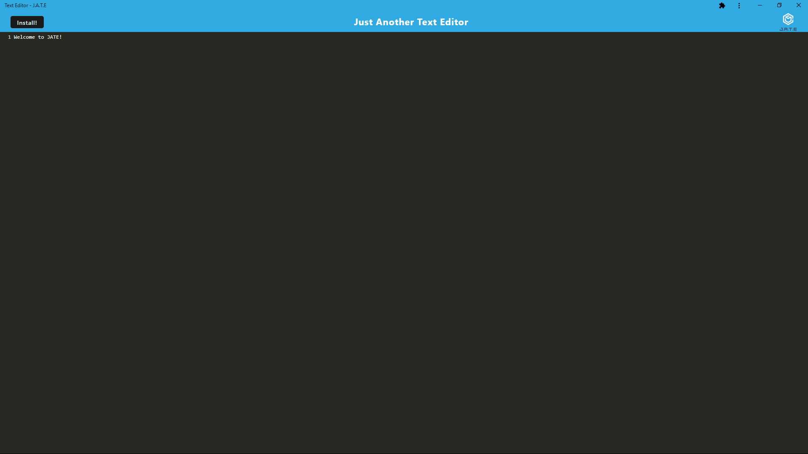

# Text-Editor

## Description

A text editor that runs in the browser!

## Table of Contents

- [Installation](#installation)
- [Usage](#usage)
- [Credits](#credits)
- [License](#license)
- [Author](#author)

## Installation

1. Go to the website: https://jatepleasework-5274179ebe2f.herokuapp.com/

## Usage

Go to the website: https://jatepleasework-5274179ebe2f.herokuapp.com/

## Credits

## Author

email: kaseyabrown28@gmail.com

github: https://github.com/brownKasey

## License

This project is using the Mit License.
